# KL Rush · Jom Pecut di KL

**An open-world Kuala Lumpur you can drive, right in your browser.** No download, works on desktop and phone.

### ▶ [Play the preview at kl-rush.vercel.app](https://kl-rush.vercel.app)

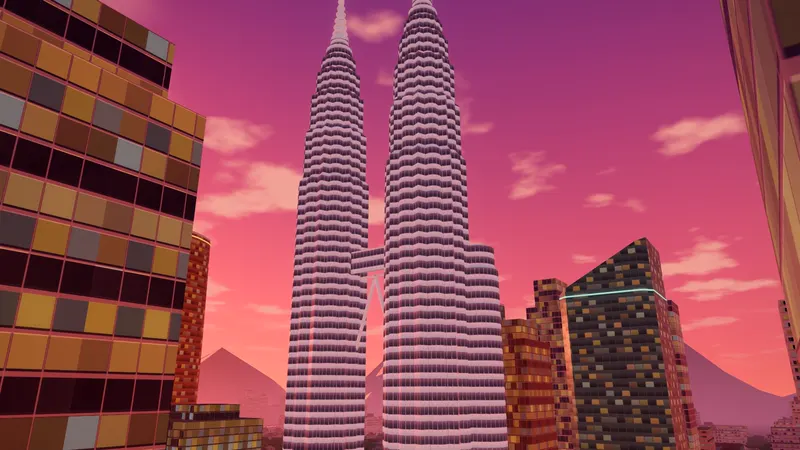

**Version 0.3.2 Preview.** The whole game is playable, but it is still growing toward 1.0 and your progress may be reset before then. [What's new](CHANGELOG.md) · [Roadmap](ROADMAP.md) · [Report a bug or suggest an idea](https://github.com/chengboonrong/kl-rush-preview/issues/new?template=feedback.yml) · [☕ Support on Ko-fi](https://ko-fi.com/chrischeng9297)

🎬 [Watch the 36-second trailer](media/kl-rush-trailer-720p.mp4)

## What you can do

- **Drive and ride through KL**:
  - Kapcai, cars, buses and a sports car, on left-hand roads with traffic lights, monorail trains overhead and traffic that overtakes and filters.
  - Pass the Petronas Twin Towers, KL Tower, Merdeka 118, the Sultan Abdul Samad Building, Masjid Jamek, Central Market, Petaling Street and the Jalan Alor night market.
- **Day, night and tropical rain**: golden-hour skylines, neon and lanterns after dark, afternoon storms that leave the roads shining.
- **Six story missions** with medals and replays. Side jobs: taxi, delivery, city bus route and street races.
- **Police chases** with five wanted levels, plus an impound lot and a car wash to clear your name.
- **Garage**: buy vehicles and upgrade engine, tyres, armour and nitro. Change the paint.
- **English and Bahasa Malaysia.** Keyboard and mouse, gamepad or touch.

## Screenshots

| | |
| --- | --- |
| 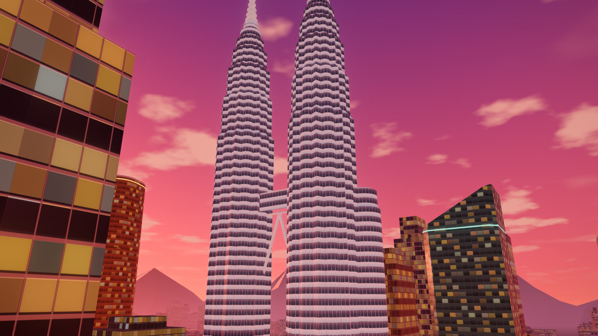 | 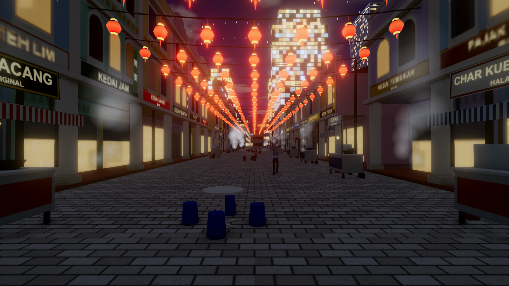 |
| 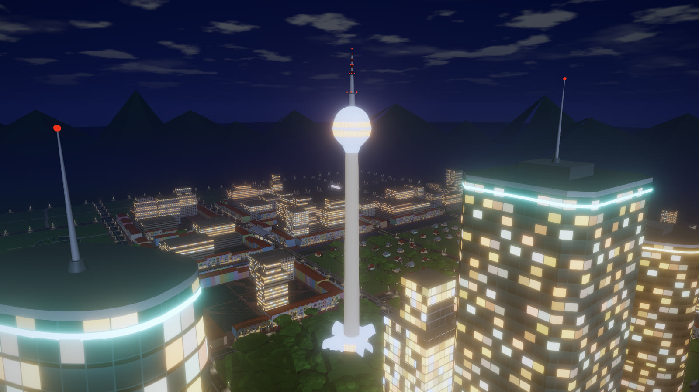 | 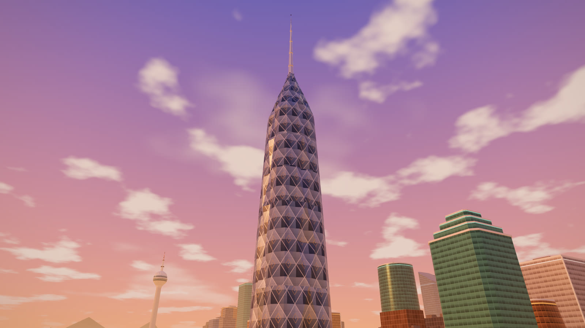 |
| 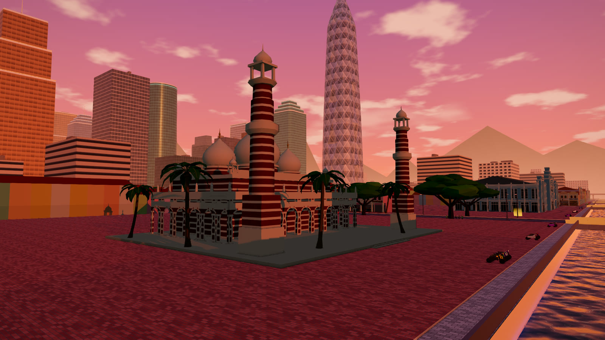 | 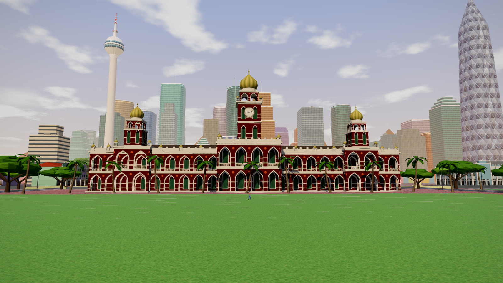 |
| 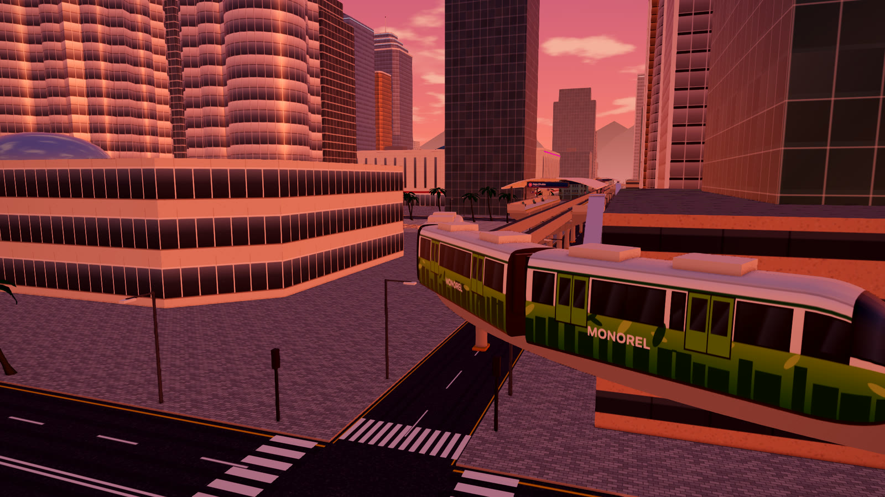 | 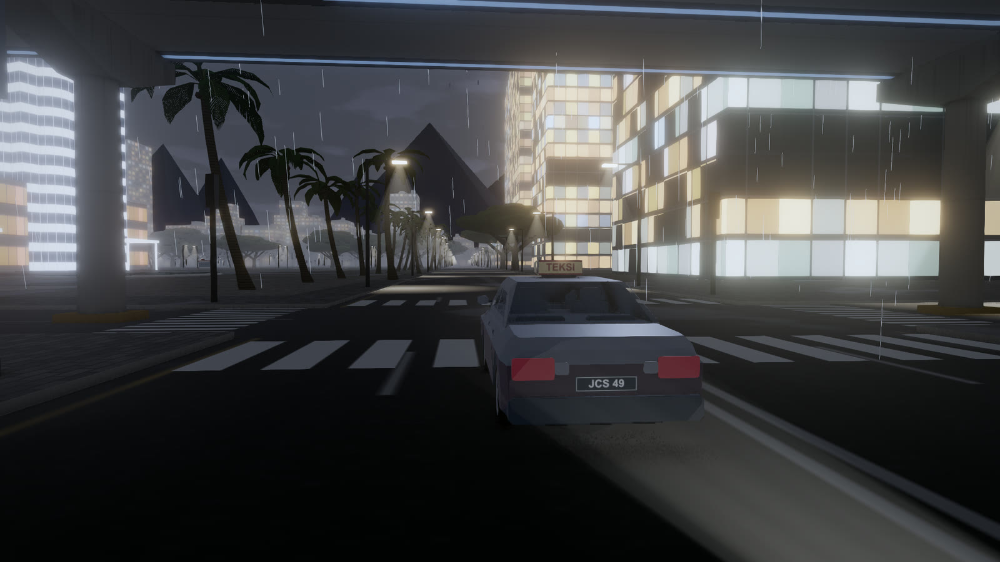 |
| 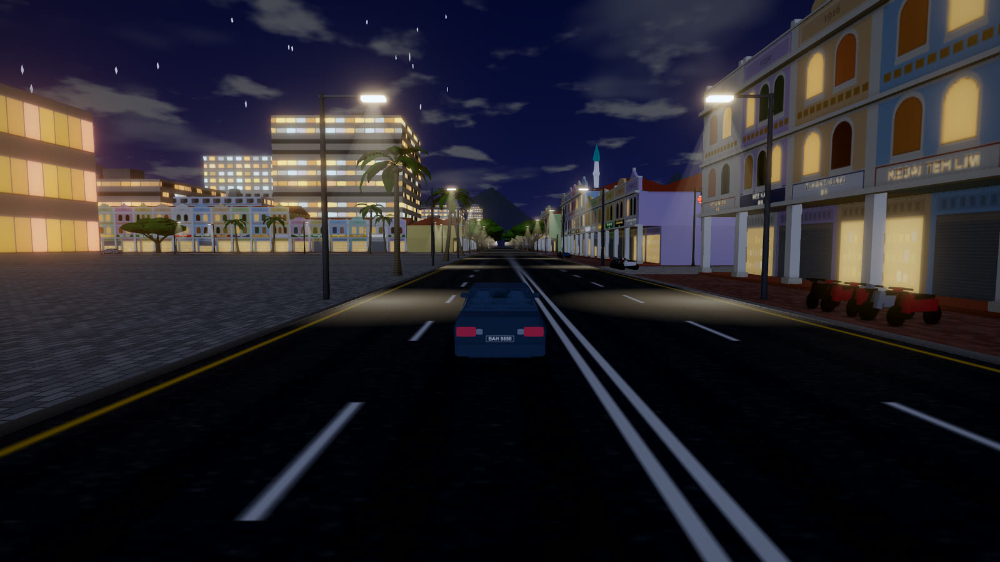 | 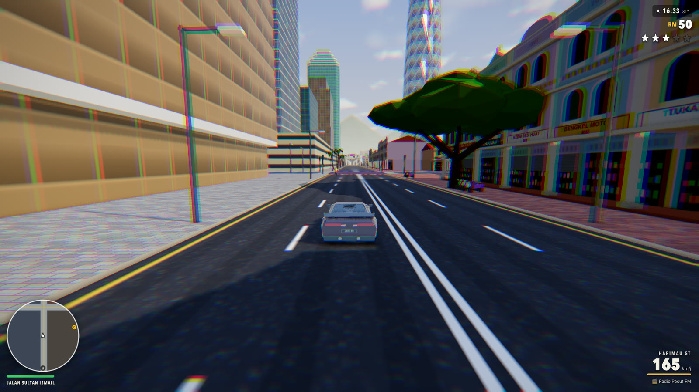 |

## Feedback

Found a bug or have an idea? Use **Feedback** on the game's title screen or pause menu. It opens [the feedback form](https://github.com/chengboonrong/kl-rush-preview/issues/new?template=feedback.yml) with your version, browser and device already filled in. You need a free GitHub account to post.

## Support KL Rush

KL Rush is free to play with no ads. If you enjoy it and want to help it reach 1.0, you can buy me a coffee on Ko-fi:

### ☕ [ko-fi.com/chrischeng9297](https://ko-fi.com/chrischeng9297)

Donations are optional and go toward development time and testing on real devices. Playing, reporting bugs and sharing the game help just as much. Terima kasih! 🙏

## System notes

- Best in a recent **Chrome, Edge or Safari** (desktop or phone). The game uses WebGPU where available and falls back to WebGL2.
- Your progress is saved in your browser. Clearing site data deletes it.
- Phones use lower graphics settings automatically. You can change this in Settings.
- **On a phone, play in landscape and full screen.** On iPhone, tap Share → **Add to Home Screen** and open KL Rush from there for full screen. The first load on a phone can take up to a minute.

## About

KL Rush is an independent game made in Malaysia. It is **not affiliated with or endorsed by** the owners of the buildings, brands and places it depicts; their names belong to their respective owners.

Privacy: no accounts, ads or tracking; optional anonymous error reports. See [PRIVACY.md](PRIVACY.md).

The game's source code is private. This repository holds the public preview page, release notes and feedback. © 2026 chengboonrong. All rights reserved: see [NOTICE.md](NOTICE.md).
